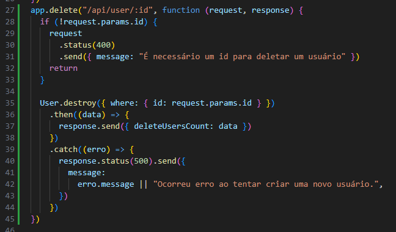
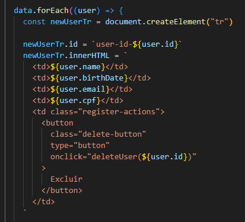
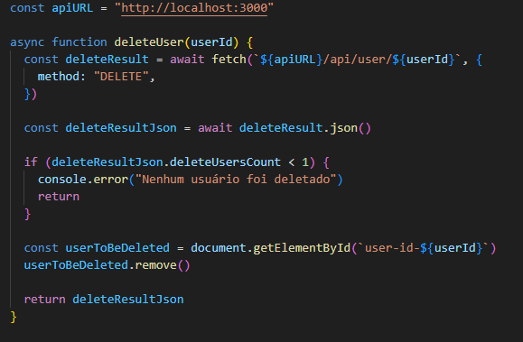

# Passo a passo de como criar a funcionalidade para deletar usuário

## Para abrir o README.md em modo de visualização no próprio VSCode, clique no arquivo com o botão direito e em Open Preview

## 1 - Criando o endpoint de deleção



No arquivo server.js precisamos criar o endpoint que será responsável por deletar o nosso usuário. O método HTTP utilizado é o delete, para sinalizar que um registro está sendo deletado.

O id é passado na própria rota e capturado dentro dos params com o nome de id, em request.params.id, e é verificado se esse parâmetro foi enviado ao servidor corretamente, caso não tenha sido é desenvolvido o código de status 400 que significa "Não encontrado".

Utilizando o modelo de User, chamamos a função destroy para fazer com que o usuário com o id passado seja deletado

## 2 - Criando o botão na tela para deletar o usuário



Primeiro alteramos na listagem de usuários para criar um novo td, que contém o botão de deletar usuário que chamará nossa função que vai deletar o usuário, a função deleteUser, que recebe o parâmetro do id do usuário a ser deletado. Também colocamos um id no próprio tr para podermos deletar esse elemento quando necessário.

No arquivo css, foi adicionado o seguinte código para estilização do botão:

```css
.delete-button {
  padding: 6px 10px;
  border: none;
  border-radius: 4px;
  cursor: pointer;
  background-color: #f44336;
  color: white;
}
```

No arquivo HTML, dentro das colunas da tabela foi adicionado um novo <th> para as ações (no caso deletar um usuário):

```html
<th>Ações</th>
```

## 3 - Criando a função que chama o endpoint para deletar o usuário quando clicado no botão



Por fim é criado a função deleteUser que é chamada no botão criado no passo 2, ela recebe o id do usuário a ser deletado e faz a chamada para a API com o método delete, e em seguida busca a linha das informações do usuário e remove o elemento da tela para atualizar a lista.

## Agora criem a mesma funcionalidade para a página de serviços e animais!
